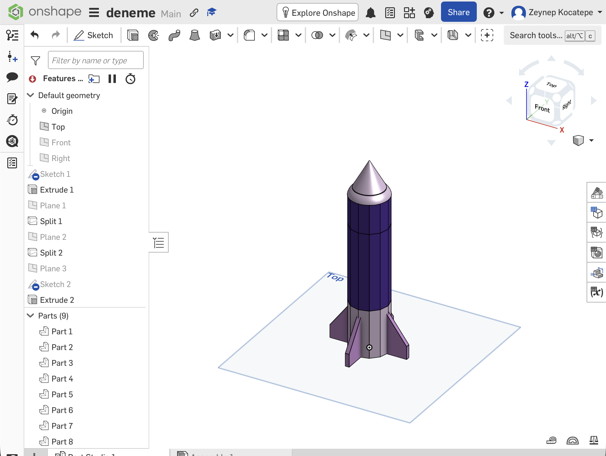

---
title: "Week 01: Recreating a 3D-Printed Rocket in Onshape"
date: 2026-09-29
draft: false
---

## 1. The physical rocket

We were given a rocket made from 3D-printed parts. First, we assembled the parts to understand how the pieces connected and how the final rocket was structured.

The rocket consisted of a cylindrical body, a nose cone, a lower tail section, and several separate pieces that fitted together.

## 2. Starting the Onshape model

I recreated the rocket in Onshape. I started by drawing a circle in a sketch and used **Extrude** to create the main cylindrical body.

To divide the body into separate sections, I created construction planes. I used the **Split** tool with these planes to separate the cylinder into three parts.

## 3. Creating the connections

The rocket parts needed to fit into each other. I created partial holes and openings instead of cutting through the entire body. These openings were large enough for the connecting parts to enter while keeping the rest of the structure intact.

I also used the **Hole** feature. One of the holes had a diameter of 0.9 cm and a depth of 3.9 cm.

## 4. Creating the lower tail section

For the lower section, I first sketched a triangular shape. I used symmetry to enlarge and position the shape correctly.

I then used **Extrude** to give the triangle thickness. To create the other tail pieces evenly around the body, I used **Circular Pattern** and repeated the feature four times.

## 5. Creating curved parts

I used additional sketches and the **Revolve** tool to create the rounded parts of the rocket. I also used **Thicken** where a surface needed to become a solid part.

## 6. Final model

The final Onshape model contained nine separate parts.

This process helped me understand how sketches, extrusions, construction planes, splits, holes, revolved features, symmetry, and circular patterns can be combined to recreate a physical object.

## Design photo

